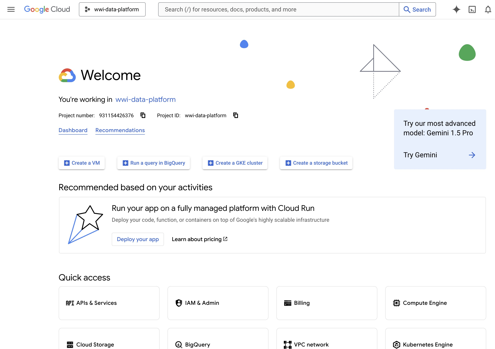
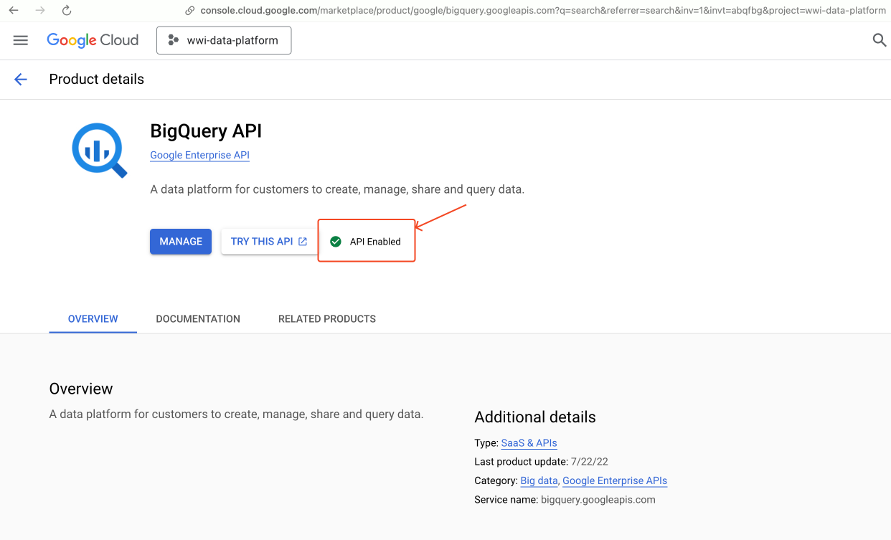

# Project WideWorldImporters Data Platform

This is my side project building a data platform with dataset WideWorldImporters. Using Prefect, dbt, BigQuery, Holistics.

- [Project WideWorldImporters Data Platform](#project-wideworldimporters-data-platform)
  - [Roadmap](#roadmap)
  - [Progress updates](#progress-updates)
  - [Local development guide](#local-development-guide)
    - [1. Prequisites](#1-prequisites)
    - [2. Install codebase](#2-install-codebase)
    - [3. Restore the database](#3-restore-the-database)
    - [4. Setup GCP BigQuery](#4-setup-gcp-bigquery)
      - [4.1 Create a GCP Project](#41-create-a-gcp-project)
      - [4.2 Enable the BigQuery API](#42-enable-the-bigquery-api)
      - [4.3 Create Service Account Credentials](#43-create-service-account-credentials)
      - [4.4 Configure Local Environment](#44-configure-local-environment)
      - [4.5 Create BigQuery Datasets](#45-create-bigquery-datasets)
- [Data Catalog](#data-catalog)
  - [Dataset Overview](#dataset-overview)
    - [1. Workflow for warehouse stock items](#1-workflow-for-warehouse-stock-items)
    - [2. Data warehouse and analysis workflow](#2-data-warehouse-and-analysis-workflow)
    - [3. Additional workflows](#3-additional-workflows)
    - [4. Fiscal year](#4-fiscal-year)
  - [OLTP Database](#oltp-database)
    - [1. Data schemas](#1-data-schemas)
    - [2. Secure-access schemas](#2-secure-access-schemas)
    - [3. Development schemas](#3-development-schemas)
  - [Data Warehouse](#data-warehouse)
    - [1. Dimension tables](#1-dimension-tables)
    - [2. Fact tables](#2-fact-tables)

## Roadmap

- [ ] Design architecture
- [x] Initialize Postgres with dataset
  - [x] Database catalog
- [x] Setup GCP BigQuery
- [ ] Prefect deployment
  - [x] Configure Prefect docker infrastructure
  - [ ] Secret management
  - [ ] Prefect deployment strategy
- [ ] Build Prefect flows to push data from Postgres to BigQuery into raw layer
- [ ] Data warehouse architecture and design
- [ ] Build dbt project to transform data in raw layer to later layers
- [ ] Register Holistics account and build dashboard

## Progress updates

<details>
  <summary><b>2025-03-03:</b> Configure Prefect docker infrastructure</summary>
  
  <video src="https://pub-875fa80acf3e4df896d4aa004cc46db6.r2.dev/prefect-docker-make-up.mp4"></video>
</details>

- **2025-25-02**: Setup GCP BigQuery

- **2024-20-12**: Initialize the project

## Local development guide

### 1. Prequisites

- UV version >= 0.6.2, [Installation guide](https://docs.astral.sh/uv/getting-started/installation/)
- Python version >= 3.11 (3.11.10 recommended)
- Docker with docker compose V2 (at least 2 core and 2GB of RAM). [Installation guide](https://docs.docker.com/engine/install/)
- GCP Account. You can use free tier account. [Signup here](https://cloud.google.com/)
- GCP CLI - `gcloud` [Installation guide](https://cloud.google.com/sdk/docs/install)

### 2. Install codebase

1. Clone the repository & go to the project location (`cd wwi-data-platform`)

2. Install python dependencies

```bash
uv sync --frozen --dev
```

3. Activate the virtual environment

```bash
. .venv/bin/activate
```

From now, you can use `uv` to manage python packages. The python executable is automatically installed and managed by uv.

4. Copy `.env.example` to `.env` and fill in the environment variables

```bash
cp .env.example .env
```

5. Start docker services

```bash
make up
# Or use command
docker compose -f deployment/docker_compose/docker-compose.dev.yaml -p wwi-data-platform up -d
```

6. Visit [Makefile](./Makefile) to short-binding commands

### 3. Restore the database

1. Download dump file at https://github.com/Azure/azure-postgresql/blob/master/samples/databases/wide-world-importers/wide_world_importers_pg.dump

2. Spawn up the postgres container, notice that there's 5 users: `admin`, `azure_pg_admin`, `azure_superuser`, `greglow`, `data_engineer`. Detail visit file [init.db](./deployment/data/init_db.sh)

3. Copy dump file to container

```bash
docker cp ./wide_world_importers_pg.dump database:/backups/wide_world_importers_pg.dump
```

4. Restore (inside postgres container)

```bash
docker exec database /bin/bash -c "pg_restore -h localhost -p 5432 -U postgres -W -v -Fc -d wideworldimporters < /backups/wide_world_importers_pg.dump"
```

Then enter postgres's password and take a coffee.

### 4. Setup GCP BigQuery

#### 4.1 Create a GCP Project

1. Sign in to your Google Cloud Console at [https://console.cloud.google.com/](https://console.cloud.google.com/)
2. Click on the project dropdown at the top of the page
3. Click on "New Project"
4. Enter a project name (e.g., `wwi-data-platform`) and select an organization if applicable
5. Click "Create"

After creating the project, here's what the console looks like:



#### 4.2 Enable the BigQuery API

1. Go to the [API Library](https://console.cloud.google.com/apis/library) in the Google Cloud Console
2. Search for "BigQuery API"
3. Click on "BigQuery API" in the results
4. Click "Enable"



#### 4.3 Create Service Account Credentials

1. Navigate to "IAM & Admin" > "Service Accounts" from the sidebar
2. Click "Create Service Account"
3. Enter a service account name (e.g., `wwi-bigquery-sa`) and description
4. Click "Create and Continue"
5. Assign the following roles:
   - BigQuery Admin
   - BigQuery Data Editor
   - BigQuery Job User
6. Click "Continue" and then "Done"
7. In the Service Accounts list, find your newly created service account
8. Click the three dots in the Actions column and select "Manage keys"
9. Click "Add Key" > "Create new key"
10. Select JSON as the key type and click "Create"
11. The key file will be automatically downloaded to your computer

After having the key file, you should save it in a secure location. This key file will be used to authenticate your Python client to interact with BigQuery.

> [!IMPORTANT]
> Do not share or commit the key file.

Authenticate with the created service account key:

```bash
gcloud auth activate-service-account --key-file=service-account-key.json
```

The console should show this:

```bash
Activated service account credentials for: [<service-account-email>]
```

#### 4.4 Configure Local Environment

Add the following environment variables:

```bash
# GCP Configuration
GOOGLE_APPLICATION_CREDENTIALS=/path/to/your/service-account-key.json
GCP_PROJECT_ID=your-project-id
```

#### 4.5 Create BigQuery Datasets

1. In the Google Cloud Console, navigate to BigQuery
2. Click on your project ID in the Explorer panel
3. Click "Create Dataset"
4. Create the following datasets with the appropriate settings:

   **Raw Layer**

   - Dataset ID: `raw`
   - Data location: Choose a region close to you (e.g., `us-central1`)
   - Click "Create dataset"

   **Staging Layer**

   - Dataset ID: `staging`
   - Data location: Same as raw layer
   - Click "Create dataset"

   **Analytics Layer**

   - Dataset ID: `analytics`
   - Data location: Same as raw layer
   - Click "Create dataset"

# Data Catalog

## Dataset Overview

**Wide World Importers** (WWI) is a wholesale novelty goods importer and distributor operating from the San Francisco bay area.

<p align="center">
  
</p>

As a wholesaler, WWI's customers are mostly companies who resell to individuals. WWI sells to retail customers across the United States including specialty stores, supermarkets, computing stores, tourist attraction shops, and some individuals. WWI also sells to other wholesalers via a network of agents who promote the products on WWI's behalf. While all of WWI's customers are currently based in the United States, the company is intending to push for expansion into other countries/regions.

WWI buys goods from suppliers including novelty and toy manufacturers, and other novelty wholesalers. They stock the goods in their WWI warehouse and reorder from suppliers as needed to fulfill customer orders. They also purchase large volumes of packaging materials, and sell these in smaller quantities as a convenience for the customers.

Recently WWI started to sell a variety of edible novelties such as chilly chocolates. The company previously didn't have to handle chilled items. Now, to meet food handling requirements, they must monitor the temperature in their chiller room and any of their trucks that have chiller sections.

### 1. Workflow for warehouse stock items

The typical flow for how items are stocked and distributed is as follows:

- WWI creates purchase orders and submits the orders to the suppliers.
- Suppliers send the items, WWI receives them and stocks them in their warehouse.
- Customers order items from WWI
- WWI fills the customer order with stock items in the warehouse, and when they don't have sufficient stock, they order the additional stock from the suppliers.
- Some customers don't want to wait for items that aren't in stock. If they order say five different stock items, and four are available, they want to receive the four items and backorder the remaining item. The item would then be sent later in a separate shipment.
- WWI invoices customers for the stock items, typically by converting the order to an invoice.
- Customers might order items that aren't in stock. These items are backordered.
- WWI delivers stock items to customers either via their own delivery vans, or via other couriers or freight methods.
- Customers pay invoices to WWI.
- Periodically, WWI pays suppliers for items that were on purchase orders. This is often sometime after they've received the goods.

### 2. Data warehouse and analysis workflow

While the team at WWI use SQL Server Reporting Services to generate operational reports from the WideWorldImporters database, they also need to perform analytics on their data and need to generate strategic reports. The team have created a dimensional data model in a database WideWorldImportersDW. This database is populated by an Integration Services package.

SQL Server Analysis Services is used to create analytic data models from the data in the dimensional data model. SQL Server Reporting Services is used to generate strategic reports directly from the dimensional data model, and also from the analytic model. Power BI is used to create dashboards from the same data. The dashboards are used on websites, and on phones and tablets. Note: these data models and reports aren't yet available.

### 3. Additional workflows

These are additional workflows.

- WWI issues credit notes when a customer doesn't receive the good for some reason, or when the goods are faulty. These are treated as negative invoices.
- WWI periodically counts the on-hand quantities of stock items to ensure that the stock quantities shown as available on their system are accurate. (The process of doing this is called a stocktake).
- Cold room temperatures. Perishable goods are stored in refrigerated rooms. Sensor data from these rooms is ingested into the database for monitoring and analytics purposes.
- Vehicle location tracking. Vehicles that transport goods for WWI include sensors that track the location. This location is again ingested into the database for monitoring and further analytics.

### 4. Fiscal year

The company operates with a financial year that starts on November 1.

## OLTP Database

Visit: https://dbdocs.io/lelouvincx/WideWorldImporters

### 1. Data schemas

These schemas contain the data. Many tables are needed by all other schemas and are located in the Application schema.

| Schema      | Description                                                                                                                             |
| ----------- | --------------------------------------------------------------------------------------------------------------------------------------- |
| Application | Application-wide users, contacts, and parameters. This schema also contains reference tables with data that is used by multiple schemas |
| Purchasing  | Stock item purchases from suppliers and details about suppliers.                                                                        |
| Sales       | Stock item sales to retail customers, and details about customers and sales people.                                                     |
| Warehouse   | Stock item inventory and transactions.                                                                                                  |

### 2. Secure-access schemas

These schemas are used for external applications that are not allowed to access the data tables directly. They contain views and stored procedures used by external applications.

| Schema  | Description                                                                                                |
| ------- | ---------------------------------------------------------------------------------------------------------- |
| Website | All access to the database from the company website is through this schema.                                |
| Reports | All access to the database from Reporting Services reports is through this schema.                         |
| PowerBI | All access to the database from the Power BI dashboards via the Enterprise Gateway is through this schema. |

The Reports and PowerBI schemas are not used in the initial release of the sample database. However, all Reporting Services and Power BI samples built on top of this database are encouraged to use these schemas.

### 3. Development schemas

Special-purpose schemas

| Schema      | Description                                                                                                                        |
| ----------- | ---------------------------------------------------------------------------------------------------------------------------------- |
| Integration | Objects and procedures required for data warehouse integration (that is, migrating the data to the WideWorldImportersDW database). |
| Sequences   | Holds sequences used by all tables in the application.                                                                             |

## Data Warehouse

The WideWorldImportersDW database is used for data warehousing and analytical processing. The transactional data about sales and purchases is generated in the WideWorldImporters database, and loaded into the WideWorldImportersDW database using a daily ELT/ELT process.

The data in WideWorldImportersDW thus mirrors the data in WideWorldImporters, but the tables are organized differently. While WideWorldImporters has a traditional normalized schema, WideWorldImportersDW uses the [star schema](https://www.databricks.com/glossary/star-schema) approach for its table design. Besides the fact and dimension tables, the database includes a number of staging tables that are used in the ETL/ELT process.

| Schema      | Description                                          |
| ----------- | ---------------------------------------------------- |
| Dimension   | Dimension tables.                                    |
| Fact        | Fact tables.                                         |
| Integration | Staging tables and other objects needed for ELT/ELT. |

### 1. Dimension tables

WideWorldImportersDW has the following dimension tables. The description includes the relationship with the source tables in the WideWorldImporters database.

| Table            | Name                 | Source tables                                                                                                      |
| ---------------- | -------------------- | ------------------------------------------------------------------------------------------------------------------ |
| City             | dim_city             | Application.Cities, Application.StateProvinces, Application.Countries                                              |
| Customer         | dim_customer         | Sales.Customers, Sales.BuyingGroups, Sales.CustomerCategories                                                      |
| Date             | dim_date             | New table with information about dates, including financial year (based on November 1st start for financial year). |
| Employee         | dim_employee         | Application.People                                                                                                 |
| Stock Item       | dim_stock_item       | Warehouse.StockItems, Warehouse.Colors, Warehouse.PackageType                                                      |
| Supplier         | dim_supplier         | Purchasing.Suppliers, Purchasing.SupplierCategories                                                                |
| Payment Method   | dim_payment_method   | Application.PaymentMethods                                                                                         |
| Transaction Type | dim_transaction_type | Application.TransactionTypes                                                                                       |

### 2. Fact tables

WideWorldImportersDW has the following fact tables. The description includes the relationship with the source tables in the WideWorldImporters database, as well as the classes of analytics/reporting queries each fact table is typically used with.

| Table         | Name              | Source tables                                                  | Sample analytics                                                                                                                |
| ------------- | ----------------- | -------------------------------------------------------------- | ------------------------------------------------------------------------------------------------------------------------------- |
| Order         | fct_order         | Sales.Orders and Sales.OrderLines                              | Sales people, picker/packer productivity, and on time to pick orders. In addition, low stock situations leading to back orders. |
| Sale          | fct_sale          | Sales.Invoices and Sales.InvoiceLines                          | Sales dates, delivery dates, profitability over time, profitability by sales person.                                            |
| Purchase      | fct_purchase      | Purchasing.PurchaseOrderLines                                  | Expected vs actual lead times                                                                                                   |
| Transaction   | fct_transaction   | Sales.CustomerTransactions and Purchasing.SupplierTransactions | Measuring issue dates vs finalization dates, and amounts.                                                                       |
| Movement      | fct_movement      | Warehouse.StockTransactions                                    | Movements over time.                                                                                                            |
| Stock Holding | fct_stock_holding | Warehouse.StockItemHoldings                                    | On-hand stock levels and value.                                                                                                 |
